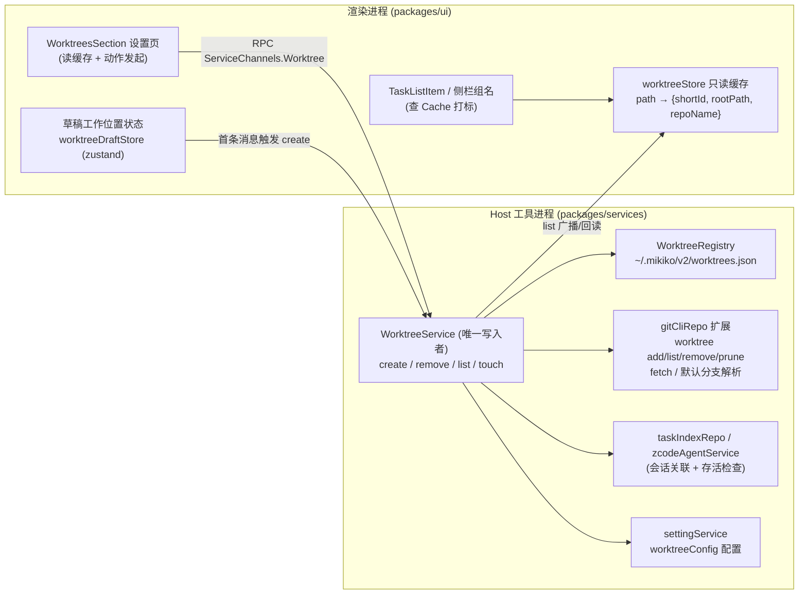
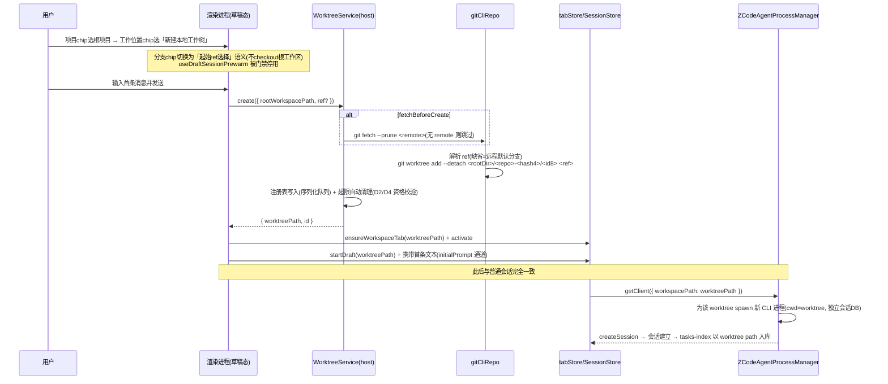

# Git Worktree 全系列功能 — 需求分析与可行性方案

> 日期：2026-10-08 · 状态：可行性分析（未实施）。落地前按 AGENTS.md 约定先沉淀为 `specs/desktop/worktrees.md`。
> 参考对象：Codex App 的 Worktree 能力（见用户提供的 4 张截图：设置 Worktrees 页 / 新建会话「创建本地工作树」/ worktree 会话上下文 chips / 创建进度面板）。

---

## 1. 需求分析

### 1.1 功能需求拆解

| 编号   | 模块       | 需求                                                                                                                | 来源          |
| ------ | ---------- | ------------------------------------------------------------------------------------------------------------------- | ------------- |
| FR-1   | 设置       | 新增 Worktrees 设置页：4 项配置 + 按「根项目」分组的工作树管理列表                                                  | 需求 §1       |
| FR-1.1 | 设置       | 配置项：工作树根目录（目录选择器）                                                                                  | 需求 §1.2.1   |
| FR-1.2 | 设置       | 配置项：创建工作树前始终获取上游更新（开关）                                                                        | 需求 §1.2.2   |
| FR-1.3 | 设置       | 配置项：自动删除旧工作树（开关）+ 数量限制（数值）                                                                  | 需求 §1.2.3/4 |
| FR-1.4 | 设置       | 列表按根项目分组：组头显示项目名 + 根路径 + 刷新按钮                                                                | 需求 §1.3.1   |
| FR-1.5 | 设置       | 每行：worktree 目录路径 + 关联会话 Title 列表 + 「在此工作树中新建聊天」/「删除」按钮                               | 需求 §1.3.2   |
| FR-2   | 新建会话   | 草稿态新增「工作位置」选项：本地 / 新建本地工作树 /（隐含第三态）现有工作树                                         | 需求 §2.1     |
| FR-2.1 | 新建会话   | 本地 = 现状：根项目 + 当前分支直接开会话                                                                            | 需求 §2.1.1   |
| FR-2.2 | 新建会话   | 新建本地工作树 = 从指定 ref（分支，缺省远程默认分支）创建 detached HEAD 工作树，随机目录名，会话根目录指向 worktree | 需求 §2.1.2   |
| FR-3   | 会话运行时 | worktree 会话与普通会话功能一致；状态栏分支位展示 worktree 语义（分离头指针）                                       | 需求 §2.2     |
| FR-4   | 斜杠命令   | `/new`：跳到当前项目的新建会话并预选工作位置/分支；worktree 会话里锁定「现有工作树·xxx + 分离头指针」               | 需求 §2.3     |
| FR-5   | 会话列表   | 本地 + worktree 会话都在左侧列表展示；worktree 会话左侧默认显示分支 icon，hover 后被置顶 icon 替换                  | 需求 §3       |

### 1.2 从 Codex 参考归纳的关键语义（必须遵守）

1. **创建时不定分支名**：`name` 只是工作树的短描述名 ≠ git branch；工作树默认 **detached HEAD**（`git branch --show-current` 为空）。
2. **ref 决定起点**：未指定 ref 时用远程默认分支（如 `origin/main`）。
3. **目录名随机**：形如 `<工作树根目录>/…/<短随机 id>/…`，与分支无关；分支名（`codex/<slug>` 风格）留到后续显式建分支/PR 流程才产生。
4. **会话根目录 = worktree 目录**：进程 cwd、会话存储、Git 面板全部以 worktree 为准，绝不回落原项目路径。

### 1.3 决策点（2026-10-08 已全部拍板 ✅）

| #   | 决策点                         | 结论                                                                                                                                                    |
| --- | ------------------------------ | ------------------------------------------------------------------------------------------------------------------------------------------------------- |
| D1  | 删除 worktree 时其下的会话历史 | **连同删除**（确认框列明受影响会话数；目录删后会话本就无法运行）                                                                                        |
| D2  | 自动删除数量限制的口径         | **按根项目**计数                                                                                                                                        |
| D3  | 侧栏中 worktree 会话的分组     | **显示层并入根项目组**（task 实体键仍用 worktree 真实 workspaceKey，仅查询扩宽 + 展示合并）                                                             |
| D4  | 自动删除的候选资格             | 仅删「无存活进程 + git status 干净 + 无未读/置顶会话」的最旧者；无可删则跳过并 warn                                                                     |
| D5  | 手机远控是否暴露管理入口       | **暴露**：手机本地 attachment 渲染完整 Root UI，服务注册进 createLocalServices 即可达；SSH 远程 workspace v1 不接入（避开 legacy 远程契约的版本硬校验） |

---

## 2. 现状盘点与可行性结论

### 2.1 代码现状（关键事实，均已核实）

**没有任何 worktree 创建能力**（全仓库无 `git worktree add`），但基础设施比预期好得多：

1. **新建会话 = 草稿态 + 底部输入框 contextHeader chips**，不是独立页面：
   - 项目 chip：`ChatEmptyWorkspacePreviewMenu`（`packages/ui/src/ChatEmptyState.tsx`），挂载于 `WorkspaceShellLayout.tsx:1179` 的 `draftComposerHeader`；
   - 分支 chip：`GitBranchSwitcher`（`packages/ui/src/GitBranchSwitcher.tsx`），选择即对**当前 workspace 共享 checkout** 执行 `gitService.switchBranch/createBranchAndSwitch`（`hooks/useGitBranchSwitcher.ts`）。→ 「工作位置」chip 加在同一处即可。
2. **会话隔离边界就是 workspacePath**：渲染层 `createSession` envelope（`packages/shared/src/zcode-protocol-v4/command.ts:46`）→ `agentService.sendConversationCommandV4` → host `ZCodeAgentProcessManager.startClient`（`packages/services/src/zcode-agent/zcodeAgentProcessManager.ts:1019`）以 `cwd = workspacePath` spawn CLI；**CLI 会话库按工作目录哈希分库**（`apps/zcode-cli/packages/bootstrap/src/app/create-app.ts:152`），worktree 目录自动获得独立会话 DB。→ 把 worktree 路径当 workspacePath 传入，进程/存储/隔离全部白拿。
3. **detached HEAD 展示已存在**：`GitHeadRefType = "branch" | "detached"`（`packages/shared/src/git.ts:3`），`resolveGitBranchTriggerLabel`（`packages/ui/src/git-branch-switcher/display.ts:54`）已渲染 `git.head.detached`（分离头指针）。→ FR-3 状态栏零改动即达标。
4. **worktree 感知已存在（只读方向）**：`GitWorkspaceRepositoryKind = "not-repository" | "main-tree" | "linked-worktree"`（`git.ts:131`）、`gitCliRepo.getWorkspaceRepositoryInfo` 检测 `.git/worktrees/<name>`（`gitCliRepo.ts:789`）、`branch-in-other-worktree` 错误映射（`gitCliHelpers.ts:124`）、CLI bash 只读策略已白名单 `git worktree list`、checkpoint 系统用临时 `GIT_INDEX_FILE` 天然 worktree 兼容。
5. **App 层斜杠命令注册点已存在**：`AppSlashCommand`（`packages/ui/src/slashCommandHelpers.ts`），`/side` `/btw` 先例在 `SessionPane.tsx:2072` 的 `appSlashCommands` memo。→ `/new` 照抄。
6. **设置子页先例完备**：`ExternalBrowserSettingsSection.tsx`（面包屑全页接管 + 写后回读校验）、`MemorySettingsSection.tsx`（分组列表 + 带 request-id 防竞态的刷新按钮）、`SettingsResourceGroup` 通用件；注册面 = `lib/settingsNavigation.ts` + `settings/settingsPageConfig.ts` + `SettingsPage.tsx` 渲染分支 + i18n。
7. **任务持久化**：`tasks-index.sqlite`（`packages/services/src/session/tasksDatabase/schema-v1.ts`）tasks 表带 `workspace_path/workspace_key`，`ZCodeTaskMeta`（`packages/shared/src/zcode-task-types-core.ts:264`）一路带到 UI。→ 「按 worktree 关联会话」= 按 workspace_path 精确查询。
8. **程序化打开 workspace 的 API 已存在**：`tabStore.ensureWorkspaceTab`（`tabStore.ts:308`）；`CreateTaskRequest` 支持 `targetWorkspace` 显式路由（`useRootWorkspaceActions.ts` `startNewTaskFromActiveWorkspace`）→ 「在此工作树中新建聊天」与 `/new` 的跳转都有现成通道。
9. **原生目录选择器已存在**：`PlatformChannels.SelectDirectory`（`desktopMainIpcPlatform.ts:105` → preload `selectDirectory()`）。
10. **草稿预热（关键坑）**：composer 挂载即 `useDraftSessionPrewarm` 在**根 workspace** 里预建 draft 会话（`v4/composer/useDraftSessionPrewarm.ts`）。选了「新建本地工作树」后必须停用预热，否则首条消息发进根项目。

### 2.2 可行性结论

**完全可行，且是低风险增量**。核心论据：

- worktree 会话的运行时 = 「一个普通本地 workspace」，workspacePath 换成 worktree 目录后，spawn、协议、会话库、Git 面板、checkpoint、远控 attach **全部复用，零协议/CLI 改动**（v1）。
- worktree 的「创建/删除/列表」是 host 进程内纯 git + 文件操作，git 命令层（`GitCommandProvider`）已有完整封装可复用。
- 所有 UI 挂载点（设置子页、草稿 chips、斜杠命令、会话行 leading slot）都有同构先例。

主要风险（均有对策，见 §9）：草稿预热误建会话（门禁）、删除时运行中会话/脏工作树（资格校验）、共享 checkout 语义差异（正是 worktree 要解决的问题，反而消除了多会话互相切分支的现有冲突）、Windows 路径长度、磁盘占用。

---

## 3. 总体设计

### 3.1 状态所有权（单一写入路径）



规则：**注册表只有 WorktreeService 一个写入者**（序列化写队列，参照 settingService 的 `atomicWriteText` + 排队写先例）；渲染层只有只读缓存；git 真值以磁盘为准，list 时做对账（磁盘已删的标记 stale 并提示清理）。

### 3.2 数据模型

```ts
// packages/shared/src/worktree.ts（新增，全部 additive）
export interface WorktreeConfig {
  rootDir: string; // 工作树根目录，默认 ~/.mikiko/worktrees
  fetchBeforeCreate: boolean; // 创建前 fetch 上游，默认 true
  autoPruneEnabled: boolean; // 自动删除旧工作树，默认 false
  autoPruneLimit: number; // 每根项目上限，默认 5，范围 1–50
}
export interface WorktreeRegistryEntry {
  id: string; // 8 位随机 hex（目录名，crypto.randomBytes）
  rootWorkspacePath: string; // 根项目绝对路径
  worktreePath: string; // <rootDir>/<repoName>-<rootHash4>/<id>
  ref: string; // 创建时的起点 ref（分支或 origin/HEAD）
  name: string | null; // 可选短描述（≠分支名，Codex 语义）
  createdAt: string;
  lastUsedAt: string;
}
// AppSettings 增加可选字段 worktreeConfig?: WorktreeConfig
// （protocol.ts + validationAppSettings.ts 的 object/patch 两个 schema 同步加）
```

会话关联不落新列：tasks 表 `workspace_path == worktreePath` 即精确关联；徽标信息由渲染层缓存按 path 命中，`ZCodeTaskMeta` 不动。

### 3.3 「新建本地工作树」会话时序（核心流程）



要点：

- **先建树、后开会话**：worktree 创建是独立 host RPC，成功后才切 tab 发消息。失败（非 git 仓库/fetch 失败/路径冲突）时 composer 顶部报错条提示，草稿保留不丢。
- 创建期间 composer 显示「正在创建工作树…」进度态（对应 Codex 截图 4 的进度面板；单 RPC 乐观 UI 即可，不需要插件式分阶段进度协议）。
- 「在此工作树中新建聊天」= 同链路去掉创建步骤：`ensureWorkspaceTab(worktreePath)` + `startDraft(worktreePath)`（复用 `CreateTaskRequest.targetWorkspace` 通道）。

### 3.4 删除与自动清理

- 手动删除（设置页）：确认框（列出关联会话数 + 脏文件数）→ 资格校验（无存活 CLI 进程；有运行中会话则阻止）→ `git worktree remove [--force]` → `git worktree prune` → 注册表移除 →（D1 默认）删除该 workspace 的 task 行。
- 自动清理：仅在 `create` 成功后触发，按根项目计数超限 → 按 `lastUsedAt` 最旧优先，逐个做 D4 资格校验，遇不可删即停止；`lastUsedAt` 在该 worktree 内 createSession/激活会话时 touch。

---

## 4. 改动面清单

### 新增（约 14 个文件）

| 位置                                                 | 内容                                                                                                                 |
| ---------------------------------------------------- | -------------------------------------------------------------------------------------------------------------------- |
| `packages/shared/src/worktree.ts`                    | WorktreeConfig / RegistryEntry / RPC 类型 + zod                                                                      |
| `packages/shared/src/channels.ts`                    | `ServiceChannels.Worktree = "worktree"`（+1 行）                                                                     |
| `packages/services/src/worktree/worktreeService.ts`  | create/remove/list/touch/resolveContext 编排 + 自动清理 + 写队列                                                     |
| `packages/services/src/worktree/worktreeRegistry.ts` | 注册表读写（atomicWriteText + 排队）+ 磁盘对账                                                                       |
| `packages/services/src/worktree/worktreeId.ts`       | 随机 id / 目录名 / rootHash4 派生（纯函数，单测友好）                                                                |
| `packages/ui/src/settings/WorktreesSection.tsx`      | 设置页（配置卡 + 分组列表 + 行动作）                                                                                 |
| `packages/ui/src/worktree/useWorktreeRegistry.ts`    | 渲染层只读缓存 hook（store 或上提 zustand）                                                                          |
| `packages/ui/src/v4/composer/WorkLocationChip.tsx`   | 草稿态「工作位置」chip（三态 + ref 选择联动）                                                                        |
| 测试若干                                             | `packages/services/test/worktree/*.test.ts`、设置 schema 测试（node:test + tsx，先例 `externalCdpSettings.test.ts`） |

### 修改（约 16 处）

| 文件                                                                                                | 改动                                                                                                                                                                                                 |
| --------------------------------------------------------------------------------------------------- | ---------------------------------------------------------------------------------------------------------------------------------------------------------------------------------------------------- |
| `packages/services/src/git/repo/gitCliRepo.ts`                                                      | +`listWorktrees`（`worktree list --porcelain`）、`addWorktreeDetached`、`removeWorktree`、`pruneWorktrees`、`resolveRemoteDefaultBranch`（`symbolic-ref refs/remotes/origin/HEAD` 回退 main/master） |
| `packages/services/src/node.ts`                                                                     | 注册 WorktreeService（仅桌面 host，不入 `remoteWorkspaceServiceCollection`）                                                                                                                         |
| `packages/shared/src/protocol.ts` + `validationAppSettings.ts`                                      | `AppSettings.worktreeConfig?`（object + patch 双 schema）                                                                                                                                            |
| `packages/ui/src/lib/settingsNavigation.ts` + `settings/settingsPageConfig.ts` + `SettingsPage.tsx` | 注册 `worktrees` 分区（desktop-only）                                                                                                                                                                |
| `packages/ui/src/app-shell/WorkspaceShellLayout.tsx`                                                | `draftComposerHeader` 插入 WorkLocationChip；worktree 模式下分支 chip 换 ref 选择语义                                                                                                                |
| `packages/ui/src/v4/composer/useDraftSessionPrewarm.ts`                                             | 工作位置 ≠ 本地时停用预热                                                                                                                                                                            |
| `packages/ui/src/v4/SessionPane.tsx`                                                                | 首发分支：new-worktree → 先 RPC create 再续发；`appSlashCommands` 增 `/new`                                                                                                                          |
| `packages/ui/src/store/zcodeSessionStoreWorkspaceSlice.ts`（或新 slice）                            | 草稿工作位置状态（per-workspaceKey）                                                                                                                                                                 |
| `packages/ui/src/store/tabStore.ts`（消费侧）/ workspace 组名派生                                   | worktree workspace 显示名 `项目名 · 短id`                                                                                                                                                            |
| `packages/ui/src/TaskListItem.tsx` + `workspace-grouped-tasks/task-row.tsx`                         | leading slot 增 worktree 分支 icon（hover 让位给 pin，复用现有 `pinActionButton` 互斥逻辑）                                                                                                          |
| i18n `zh-CN.ts` / `en-US.ts`                                                                        | `settings.worktrees.*`、`chat.workLocation.*`、`chat.slash.app.new.*`                                                                                                                                |

**明确不动**：v4 协议 `command.ts`、CLI（`apps/zcode-cli`）、`zcodeAgentProcessManager`、checkpoint、远控链路、Web 端（设置分区 desktop-only 过滤）。

---

## 5. 各功能实现逻辑要点

### 5.1 设置 Worktrees 页（FR-1）

- 结构照抄 `ExternalBrowserSettingsSection` + `MemorySettingsSection`：配置卡（目录选择器走 `platform.selectDirectory()`、两个开关、一个数字输入）+ 分组列表（`SettingsResourceGroupHeader` 放项目名/根路径/刷新按钮）。
- 数据：`worktreeService.list()` 一次返回 `[{ rootWorkspacePath, repoName, worktrees: [{entry, gitStatus 摘要, sessions: TaskMeta[]}] }]`——会话关联由 host 内直接查 `taskIndexRepo`（同进程），刷新带 request-id 防竞态（MemorySettings 先例）。
- 行按钮：「在此工作树中新建聊天」→ `ensureWorkspaceTab + startDraft`（见 §3.3）；「删除」→ 确认框 + RPC。
- 配置写入走 `useSettings().update`（patch 校验由 zod 保证），WorktreeService 每次**操作时**现读 settingService（同 host 进程），天然无热更问题。

### 5.2 草稿「工作位置」（FR-2）

- 状态：`draftWorkLocation: { mode: "local" | "new-worktree" | "existing-worktree", ref?: string, existingWorktreeId?: string }`，按 workspaceKey 存于 session store workspace slice。
- 联动：`local` = 现状（分支 chip 保留 checkout 语义）；`new-worktree` = 分支 chip 变「起始 ref」（新增 `selectionMode="pick-ref"`，列出本地分支 + 远程默认分支标记，**不执行 checkout**）；`existing-worktree`（由设置页按钮、`/new` 或在 worktree workspace 内新建时进入）= 显示 `现有工作树 · <短id>` 与 `分离头指针`，均不可选。
- 首发分流在 `SessionPane` 现有 createSession 发送点（~2708/2794）前置一步：mode=new-worktree → `worktreeService.create` → 切 tab → 把首条文本作为 `initialPrompt` 投递到新 workspace 草稿（复用 `CreateTaskRequest.initialPrompt` + `requestComposerTextInsert` 通道）。
- 非法态防护：非 git 仓库 / 已是 linked-worktree 的 workspace 禁用「新建本地工作树」并给 tooltip。

### 5.3 `/new`（FR-4）

- 注册进 `appSlashCommands`（`/side` 同构；关键词 new/新建/新会话；CLI 目录无冲突时过滤）。需放开「仅 `sessionId` 存在」的门禁为「会话态可用」（草稿态本就是新建页，不提供）。
- `run()`：读本会话 `workspacePath` → 若命中注册表（worktree 会话）：`startDraft(当前worktree路径)` 并把工作位置锁 `existing-worktree`（chips 不可选，展示 现有工作树·短id / 分离头指针）；否则：`startDraft(根项目路径)` + 工作位置=local + 分支 chip 预选「先前会话选择的分支」——v1 以会话创建时刻记录的起始分支为准（createSession 成功后由渲染层调 `taskService` 写一条 origin meta，`syncTaskMeta` 已有写通道），缺省回退当前 workspace 分支。

### 5.4 徽标与状态栏（FR-3/FR-5）

- 徽标：`TaskListItem` leading slot（错误点/unread/spinner 同槽位）增加 `GitBranch` icon，条件 = `worktreeRegistryCache.has(task.workspacePath)`；hover 时沿用现有逻辑让位给 `pinActionButton`（用户要求的「hover 替换为置顶 icon」即现状 pin 的互斥行为）。`GroupedTaskRow` 同步补。
- 状态栏：**零改动**——worktree 是 detached HEAD，`resolveGitBranchTriggerLabel` 已输出「分离头指针」；后续在会话里用现有 `createBranchAndSwitch` 建 `codex/<slug>` 分支即得可读分支名（Codex 语义第 5 点）。
- 侧栏组名/workspace 菜单/tab 标题：显示名派生 `根项目名 · 短id`，查渲染层注册表缓存。

### 5.5 目录与命名（Codex 对齐）

- `<rootDir>/<repoName>-<hash4(rootPath)>/<id8>`：repoName 防混淆加 root 路径 4 位 hash；id8 = `crypto.randomBytes(4).toString("hex")`，展示用前 4 位（对齐 Codex 的 `036b` 风格）。

---

## 6. 技术选型

**零新增依赖**。全部复用现有栈：Electron utilityProcess host + RPC descriptor（`createServiceDescriptor` 模式）、git 子进程封装（`GitCommandProvider`/`gitEnvironmentProvider`，env 已剥离 `GIT_DIR/GIT_WORK_TREE`）、zustand 分片、zod additive schema、node:test + tsx 测试、lucide icon（`GitBranch`）。创建进度用现有 optimistic UI + spinner 模式，不引入新通知协议。

## 7. 预计功能效果（用户视角走查）

1. 设置 → Worktrees：设根目录、开 fetch、设自动清理上限；下方按项目分组列出所有 Mikiko 工作树（路径、脏状态、关联会话 title），组头可刷新，行内可「在此工作树中新建聊天」或删除（带确认）。
2. 任一项目新建聊天：底部 chips 变为 [项目][工作位置][分支]。选「新建本地工作树」后分支 chip 变为「从哪个分支创建」，发送首条消息时出现「正在创建工作树…」，完成后自动进入 worktree 会话——状态栏显示「分离头指针」，Git 面板/diff/commit 全部作用于该 worktree，根项目 checkout 完全不动。
3. worktree 会话里输入 `/new`：切到同项目新建页，工作位置锁定「现有工作树 · 036b」、分支锁定「分离头指针」；本地会话里 `/new`：预选原分支。
4. 左侧列表：worktree 会话默认带分支小 icon，hover 显示置顶按钮；组名「项目名 · 短id」一眼区分。
5. 多个 worktree 会话可并行跑不同任务互不干扰（这正是该功能的核心价值：消除当前「多会话共享一个 checkout、切分支互相踩」的问题）。

## 8. 分期与工作量估算

| 阶段            | 内容                                                                                                                | 估算     |
| --------------- | ------------------------------------------------------------------------------------------------------------------- | -------- |
| P0 核心         | gitCliRepo worktree 命令 + WorktreeService/注册表 + 设置页 + 「新建本地工作树」全流程（含 prewarm 门禁）+ 徽标/组名 | 7–9 人日 |
| P1 补全         | `/new` + 「现有工作树」三态 chips + 删除/自动清理完整 UX + fetch 上游 + i18n 双语打磨                               | 3–4 人日 |
| P2 增强（可选） | 侧栏并入根项目分组显示（D3 备选）、`codex/<slug>` 建分支快捷流、远控端管理入口、worktree 使用遥测                   | 另计     |

## 9. 风险与对策

| 风险                                       | 对策                                                                                                    |
| ------------------------------------------ | ------------------------------------------------------------------------------------------------------- |
| 草稿预热在根 workspace 误建会话            | 工作位置 ≠ local 时 `useDraftSessionPrewarm` 直接不注册；若已预热则丢弃该 draft sessionId               |
| 删除时进程存活/脏树导致数据丢失            | 删除前强制资格校验（processManager 存活 + git status + 运行中任务），脏树默认阻止、`--force` 需二次确认 |
| 注册表并发写                               | 单写入者 + 序列化队列（settingService 同款模式），磁盘对账兜底                                          |
| 共享 checkout 语义（本地多会话切分支互踩） | 既有行为不变；worktree 即官方解法，文案中引导                                                           |
| Windows 路径长度/大小写                    | 目录命名控制长度（id8 + hash4）；路径统一 path.resolve；Win 实测列入验收                                |
| 磁盘膨胀                                   | 自动清理（D2/D4）+ 设置页显示每个 worktree 的存在时长；后续可加体积统计（P2）                           |
| 设置 schema 变更后 host 未重启             | 沿用 ExternalCdp 的写后回读校验模式，UI 明示需重启                                                      |

## 10. 验收场景（实现后逐条核验）

1. 非仓库目录新建会话 → 「新建本地工作树」禁用且有提示。
2. 选 ref=feature/x 创建 → 目录 `<rootDir>/<repo>-<hash4>/<id8>` 存在、`git -C <worktree> branch --show-current` 为空（detached）、HEAD == feature/x 顶端；开启 fetch 时创建前发生 `git fetch`。
3. 会话内改文件/commit 只影响 worktree；根项目 `git status` 不变。
4. 状态栏显示「分离头指针」；`createBranchAndSwitch` 建 `codex/foo` 后显示分支名。
5. 设置页列表分组正确、会话 title 关联正确；「在此工作树中新建聊天」直接落到该 worktree 草稿。
6. 删除：运行中阻止；干净树确认后目录+注册表+task 行清理；脏树需 force 二次确认。
7. 超限自动清理只删合格最旧项（D4），不合格跳过并 warn。
8. `/new` 两种模式预选/锁定行为符合 FR-4。
9. 侧栏徽标 + hover 置顶替换；远控 attach worktree 会话可正常续聊。
10. `pnpm typecheck`、`pnpm lint`、`pnpm architecture:check --changed` 通过；新增单测（id/目录派生、注册表对账、清理资格、schema）全绿。

---

### 附：实施前置条件

按 AGENTS.md：开工先将本方案收敛为 `specs/desktop/worktrees.md`（产品规则/状态所有者/接口/验收场景），并确认 §1.3 五个决策点后再动代码。
